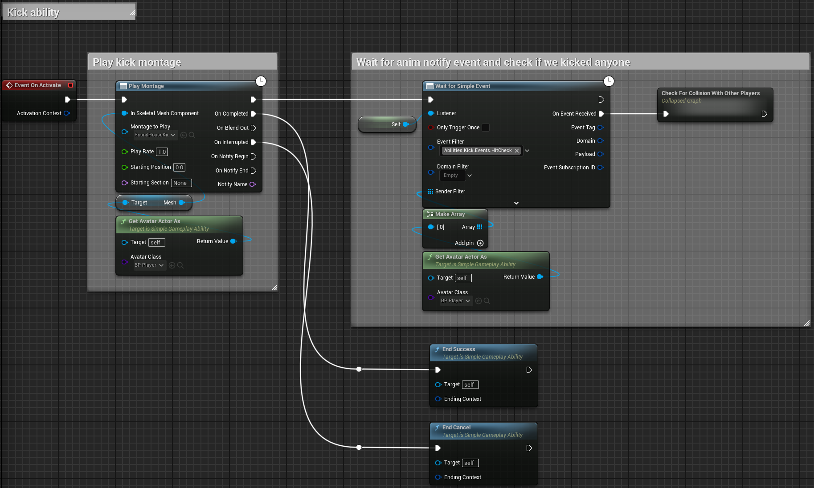
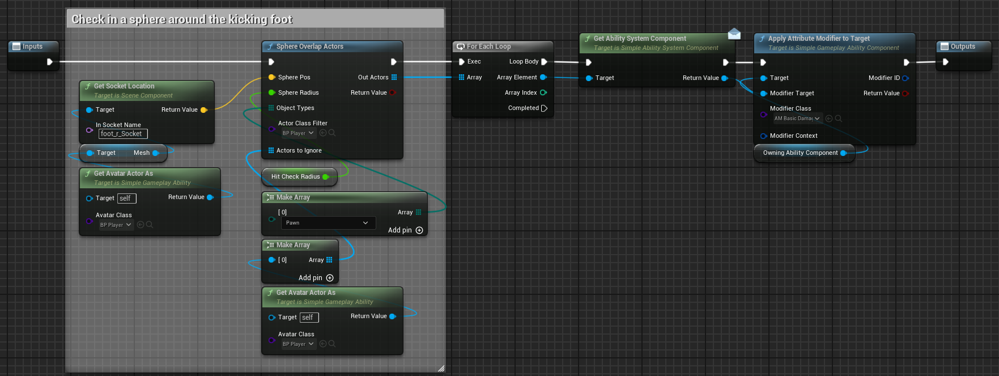

# How SimpleGAS Works

At its core, SimpleGAS consists of four main parts:

### 1. Simple Event Subsystem
- [A bundled subsystem](https://github.com/strayTrain/SimpleEventSubsystemPlugin) that allows events to be passed by gameplay tags
    - e.g. You can send an event that a player walked through a door with a payload consisting of a reference to the player. A listener (like a widget, player controller etc) can then react to this event.
- Events payloads aren't hardcoded to a type and can be any arbitrary struct
- This is used to send and receive messages from abilities
- 

### 2. Ability Component
- Each actor that can perform abilities has an **Ability Component**.
- Manages replicated **attributes** of which there are two types:
    - **Float Attributes** e.g. Health, Stamina, Speed 
    - **Struct Attributes** e.g Vector3 or a custom struct
- Handles **ability activation** and **attribute modifiers** (special abilities that can change attributes over time)
- Maintains a replicated list of **gameplay tags** which can be used to control activation of abilities and modifiers e.g. You can't activate an attack if the ability component has a "PlayerState.Stunned" tag.
- Allows for replicated events to be sent e.g. It allows the client to tell the server that an ability target was selected

### 3. Gameplay Abilities
- Defines what happens when an ability is activated (e.g. a player attacking or a door opening)
- Abilities can apply **attribute modifiers** and activate other abilities
- Abilities can be client predicted i.e. The client assumes the server will execute what it executes and activate immeadiately for the client, reducing percieved lag
- Client predicted abilities can be corrected when they mispredict using a **State Snapshot** (more on this later)

### 4. Attribute Modifiers
- A subtype of abilities that modify attributes
- Can be **instant changes** or **apply over time**.
- Attribute Modifiers can additionally trigger **side effects** e.g. On successfull application: Play a hit reaction animation, send an event and then apply a different modifier
- Modifiers can be client predicted (with some caveats we'll get into later) 

---

### Typical Workflow
1. **Define attributes that the AbilityComponent has**
    * 
2. **Create an ability** that defines what happens when the ability is activated. 
    * A typical ability might be a player playing an attack animation, checking for a target and  modifying an attribute like Health using an **Instant** modifier on the target.
    * 
    * 
    * 
3. **Grant the ability** to the activating ability component
    * 
4. **Activate the ability** when the player presses a button or some other condition is met
    * 
5. **Outside of the ability**, you might have a a widget that listens for events about attributes changing (sent through the **SimpleAbilitySubsystem** automatically by the attribute modifier) and update the UI based on the player's health attribute.
    * 
6. **Result**
<video width="640" height="360" controls>
<source src="videos/kick_result.mp4" type="video/mp4">
Your browser does not support the video tag.
</video>

---

### How does replication and prediction work?

Let's take a look at replication first  

The **AbilityComponent** maintains a 2 lists of **AbilityState**: 
* An authoritative replicated list only written to by the server
* A predicted non replicated list used by clients when activating predicted abilities.  

An **AbilityState** is a struct that contains:
* Information about the ability that was activated
* A status enum representing if the ability is active, ended or cancelled
* An array of **StateSnapshots** representing the state of the ability at different times
    * A **StateSnapshot** is an arbitrary struct representing the state of the ability when it was taken. e.g. A struct containing references to other actors hit by an ability after an overlap check.
    * If an ability is **client predicted** the both the client and server will take a snapshots using a custom struct. The client saves its snapshot to the predicted **Ability State** and the server saves its snapshot to the authoritative **Ability State**.
    * When the server replicates the authoritative **Ability State** to the client, the client compares the server's snapshot to its own. If they match, the client continues as normal. If they don't match, the client triggers a callback where you can implement logic to fix the misprediction.
    * Here's a visual walkthrough of the process extending the previous example of a kick ability:
    * 
    * 
    * 

Abilities have an **Activation Policy** that determines how they are replicated:
* **Local Only**: The ability is only activated on the client that requested it
* **Client Predicted**: The ability is activated on the client immeadiately and the server is informed of the activation. The server can then choose to accept or reject the activation. If the server rejects the activation, the client cancels the ability it predicted to activate.
* **Server Initiated**: The ability is activated on all connected clients but is always activated on the server first. When a client activates an ability of this type, it sends a request to the server to activate the ability. The server then tries to activate the ability and informs all clients of the activation.
* **Server Only**: The ability can only be activated by the server and does not replicate a new **AbilityState** to clients.

When an ability is activated on the server: 
1. An instance of the ability is created on the server and a matching state is added to the authoritative **AbilityState** list.
2. The ability is activated on the server and the state is updated with the result of the activation.
3. The authoritative state is replicated to all clients.
4. Upon receiving the new state, the client activates the ability if it was activated on the server with the same context and activation time.

When an ability is activated on the client:
1. An instance of the ability is created on the client and a matching state is added to the predicted **AbilityState** list.
2. The ability is activated on the client and the state is updated with the result of the activation.
3. The client sends a request to the server to activate the ability passing along the ability's unique identifier and context.
4. The server tries to activate the ability and creates a matching state in the authoritative list.
5. The authoritative state is replicated to all clients. If 

