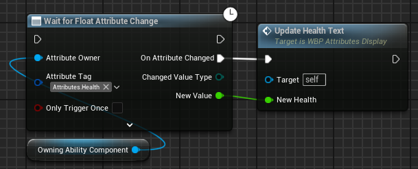

{: .warning }
These docs are a work in progress. If you have any questions or need help, please reach out on the repository's [Discussions](https://github.com/strayTrain/SimpleGameplayAbilitySystem/discussions) page.

# Simple Gameplay Ability System (SimpleGAS)

[SimpleGAS](https://github.com/strayTrain/SimpleGameplayAbilitySystem) provides an alternative to Unreal Engine's built-in [**Gameplay Ability System (GAS)**](https://dev.epicgames.com/documentation/en-us/unreal-engine/gameplay-ability-system-for-unreal-engine), focusing on developer experience and flexibility.

## Why Use SimpleGAS?

**GAS** is powerful but comes with a steep learning curve and requires a lot of boilerplate code to get started.  
**SimpleGAS** aims to streamline the process by allowing for purely blueprint based setup and operation.

## Some problems that SimpleGAS can help you solve:

  
As you add more game mechanics, you find yourself with giant blueprints that do too much stuff

You can use a `SimpleAbility` to  break down your game mechanics into smaller, more manageable pieces.  
  * Abilities are reusable and can be combined to create more complex mechanics.
  * Abilities can take any struct as an input

Example: Activating an ability which launches the player using a custom struct called LaunchParams

Inside the ability

  
You want to create status effects (like burning or stunned) that effect stats like health

`SimpleGameplayAbilityComponent` supports **Attributes**. 
- An Attribute represents a stat like health, strength, stamina etc.
- Attributes are easy to define using [gameplay tags](https://www.tomlooman.com/unreal-engine-gameplaytags-data-driven-design).  
  
- There are two types of Attribute that you can create:
  - Float attributes to represent numerical stats  
  - Struct attributes to represent more complex stats  
- When attributes change they automatically send events which are easy to listen for.  
  - e.g. Here is how you would set up a widget to update the player's health when it changes  
    
- You can collect attributes into [data assets](https://dev.epicgames.com/documentation/en-us/unreal-engine/data-assets-in-unreal-engine) called **Attribute Sets** to reuse them between different `AbilityComponents`.

`SimpleGameplayAbilityComponent` also supports **AttributeModifiers**.
- AttributeModifiers can change multiple attributes at once.
- They can apply over time or instantly.
- They can also trigger side effects like activating abilities or applying more status effects. 

Examples where AttributeModifiers are useful:
- You want to apply a buff that increases the player's health and damage permanently.
- You want to deal damage to a target
  - If they have an attribute called `Armor`, reduce that value and if it drops below 0 reduce the leftover damage from `Health`.
  - If they don't have an `Armor` attribute, deal damage directly to `Health`.
- You want to deal damage to a target player
  - If they are blocking, reduce the incoming damage by a percentage.
  - If they are parrying, cancel the damage and apply a stun effect to the attacker instead.
- A burning status effect that deals damage over 5 seconds.
  - When it is first applied it does 10 damage and then 2 damage every second for 5 seconds.
  - It adds fire particles to the target on application
  - When removed, the fire explodes, causing nearby targets to also burn.

  
You want to make a multiplayer game but aren't sure how to structure your game for it

- Abilities, Attributes and Attribute Modifiers all support replication out of the box.  
- Abilities and Attribute Modifiers can be client [predicted](https://en.wikipedia.org/wiki/Client-side_prediction) allowing for a smooth experience even with high latency.
  - Abilities can take snapshots of their state (using arbitrary structs) which you can use to detect and fix differences between the client and server simulation.
    - This allows the client version of the ability to react immediately to player input while having a flexible way to correct any differences with the server.
  - Attribute Modifiers can apply immediately on the client and then get automatically corrected if the server doesn't successfully apply them. Example:
    - The client predicts a hit and applies a damage attribute modifier which changes the targets health and triggers a hit reaction ability.
    - The server decides the hit was blocked
    - As soon as the client receives the server's decision, it undoes the damage, sending an event for the corrected value, and cancels the hit reaction ability.

