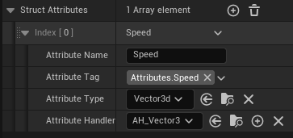

# Attributes

Attributes are the values that define your game characters and objects - things like health, stamina, speed, or any other stats you want to track. SimpleGAS gives you two types of attributes to work with: Float Attributes for simple numbers and Struct Attributes for more complex data.

## Float Attributes

Float Attributes are your basic numerical values. Think health points, mana, movement speed - anything that's just a number.


Each Float Attribute has:

- **Attribute Name**: Just a friendly label to help you identify it in the editor
- **Attribute Tag**: The unique gameplay tag that identifies this attribute
- **Base Value**: A "permanent" value that represents the inherent stat
- **Current Value**: The actual value used during gameplay that can be modified temporarily
- **Value Limits**: Optional min/max boundaries for the attribute values

For example, a character might have a Base Strength of 10, but a Current Strength of 15 due to a temporary buff. When the buff wears off, the Current Strength goes back to the Base Value.

```
Health Attribute:
- Base Value: 100 (your character's natural health)
- Current Value: 85 (after taking some damage)
- Min Current Value: 0 (can't go below zero)
- Max Current Value: 100 (can't exceed base health without buffs)
```

You can choose to only use Current Value if that's all you need - the Base Value is there when you want that extra layer of "permanent vs temporary" changes.

## Struct Attributes

Sometimes a simple number isn't enough. That's where Struct Attributes come in - they can store complex data like inventory items, skill trees, or any custom data structure you create.



Struct Attributes have:

- **Attribute Name**: A friendly editor label
- **Attribute Tag**: The unique identifier
- **Attribute Type**: The UE struct type this attribute holds (like FPlayerStats)
- **Attribute Handler**: An optional class that processes changes to the struct

Struct Attributes are great for things like:
- Equipment stats with multiple values
- Character appearance data
- Ability loadouts
- Complex game mechanics

### Attribute Handlers

Attribute Handlers are special classes that help manage Struct Attributes. They can:
- Set default values when the attribute is created
- React when values change
- Send events when specific parts of the struct are modified

Creating an Attribute Handler is easy:
1. Create a new Blueprint class that inherits from SimpleStructAttributeHandler
2. Override OnStructChanged to handle value changes


## How Attributes Are Updated

Attributes don't usually change on their own - they get modified by:

1. **Direct API calls**: Code that directly sets attribute values
2. **Attribute Modifiers**: Special objects that can add, multiply, or override attributes
3. **Ability Side Effects**: Abilities that modify attributes as part of their execution

When an attribute changes, SimpleGAS automatically sends an event so other systems (like your UI) can react to the change.

## Attribute Sets

If you find yourself creating the same attributes for different characters, Attribute Sets can help. They're reusable collections of attributes that you can add to any ability component.

To create an Attribute Set:
1. Right-click in the content browser
2. Choose Create → Data Asset
3. Select "Attribute Set" as the class
4. Add your attributes to the set

Now you can add this set to any ability component instead of manually recreating the same attributes.

## Behind the Scenes: Replication

In multiplayer games, attributes need to stay synchronized between the server and clients. SimpleGAS handles this automatically:

- The server is always the authority for attribute values
- When attributes change on the server, the new values are replicated to clients
- Clients can display attribute values but can't directly change them
- If using client prediction, clients can temporarily modify attributes locally and then correct them when the server updates arrive

You generally don't need to worry about this - just remember that for multiplayer games, the server makes the final decisions about attribute values.

## Tips for Working with Attributes

- **Use meaningful tags**: Create a clear naming convention for attribute tags
- **Set sensible limits**: Use min/max values to prevent exploits or weird behavior
- **Group related attributes**: Keep related attributes in the same AttributeSet
- **Document your attributes**: Especially for team projects, document what each attribute means
- **Use Current/Base wisely**: Base values are great for "permanent" stats, while Current values work well for values that change during gameplay

Attributes form the foundation of your game's systems - taking time to design them well will make building the rest of your gameplay much easier!