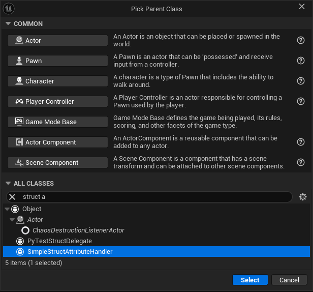
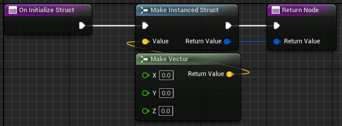

# Attributes

## Float Attributes

A `FloatAttribute` represents a single numerical value like Health, Stamina, Lives etc:  
      

Let's break down the variables:
1. `Attribute Name` is a cosmetic editor only value that makes it easier to scan through the list of float attributes in the editor. e.g.  
    
2. `Attribute Tag` is the gameplay tag that identifies this attribute. 
    * This tag must be unique. 
    * If multiple float attributes have the same tag, only the last one will be used.
3. `Base Value` is the "innate" value of the attribute. 
4. `Current Value` is the current value of the attribute. 
5. `Value Limits` enabling value limits allows you to clamp the associated value when it gets updated.  
    * e.g Ensuring Base Health can't go below 0.

{: .tip }
You can choose to only use the `current value` if you want. The `base value` is included as it is a common pattern to do something like `damage = base value + current value` (where current value acts like a bonus value).

---

## Struct Attributes
  
* A `StructAttribute` represents a more complex value like a Vector3 or a custom struct.
    

    1. `Attribute Name` behaves the same as the float attribute name.  
    2. `Attribute Tag` behaves the same as the float attribute tag.
    3. `Attribute Type` is the type of struct that is being represented.  
        * e.g. If you have a struct called `FPlayerStats` you would select `FPlayerStats` from the dropdown.
        * If you later try to update the attribute with a different struct type, it will generate a warning and skip the update.
    4. `Attribute Handler` is an optional class that you can create to deal with changes to the struct variable members.
        * 
        * The class has two overridable functions:
            * `OnInitializeStruct` provides default values for the struct members
            
            * `OnStructChanged` allows you to compare the old and new struct values and send events based on the changes
            

{: .note }
If you don't supply an attribute handler, a more generic event is sent when the struct changes. The `EventTag` is `SimpleGAS.Events.Attributes.StructAttributeValueChanged` and the `DomainTag` is the tag of the struct attribute.

---

## Attribute Sets

* Similar to `AbilitySets`, `AttributeSets` are a way to group attributes together and share them between different ability components.
* To create an `AttributeSet` data asset, right-click in the content browser and go to `Create -> Miscellaneous -> Data Asset` for the data asset class select `Attribute Set`
* If an attribute is defined in multiple attribute sets, the last one will be used. 
