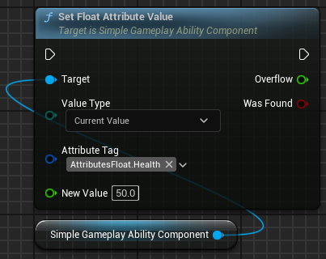

# Attributes

Attributes are values that define stats for your `GameplayAbilitySystemComponent` e.g. health, stamina, speed.  
SimpleGAS gives you two types of attributes to work with: Float Attributes for simple numbers and Struct Attributes for more complex data.

## Float Attributes

- `Attribute Name`: A friendly label to help you identify the attribute in the editor
- `Attribute Tag`: A unique gameplay tag that identifies this attribute
- `Base Value`: A "permanent" value that represents the inherent stat
- `Current Value`: The actual value used during gameplay that can be modified temporarily
    - For example, a character might have a Base Strength of 10, but a Current Strength of 15 due to a temporary buff. When the buff wears off, the Current Strength goes back to the Base Value.
- `Value Limits`: Optional min/max boundaries for the attribute

Tip: You can choose to only use Current Value if that's all you need - the Base Value is there in case you want that extra layer of "permanent vs temporary" changes.

Here's what a Float Attribute looks like in the editor:

## Struct Attributes

Sometimes a simple number isn't enough. That's where Struct Attributes come in - they can store complex data like inventory items, skill trees, or any custom struct you create.

Struct Attributes have:

- `Attribute Name`: A friendly label to help you identify the attribute in the editor
- `Attribute Tag`: A unique gameplay tag that identifies this attribute
- `StructType`: The struct type this attribute represents

Here's an example of a Struct Attribute in the editor:

## How Attributes Are Updated

Attributes can be modified by:

1. Calling a function on the `AbilitySystemComponent`  
    
2. [Attribute Modifiers](../../blueprint_nodes/attribute_modifiers/attribute_modifiers.html)

When an attribute changes, SimpleGAS automatically sends an event so other systems (like your UI) can react to the change.  
You can find a list of the available events on the [Event Reference page](../../event_reference/event_reference.html).

## Attribute Sets

If you find yourself creating the same attributes for different characters, Attribute Sets can help. They're reusable collections of attributes that you can add to any ability component.

To create an Attribute Set:
1. Right-click in the content browser
2. Choose Create → Data Asset
3. Select "Attribute Set" as the class
4. Add your attributes to the set

Now you can add this set to any ability component instead of manually recreating the same attributes.

Here's what the attribute set looks like in the editor:  

Adding an attribute set to an ability component:  
