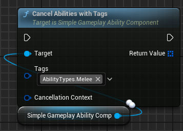

# Simple Gameplay Ability

## Editable Class Variables

---

### Activation

  
<strong>Activation Policy</strong>

The **Activation Policy** determines where and how the ability is triggered and replicated. Use the table below for a quick reference:

| **Activation Policy**     | **Description**                                                                                                                                               | **When to Use**                                             |
|---------------------------|---------------------------------------------------------------------------------------------------------------------------------------------------------------|-------------------------------------------------------------|
| **Local Only**            | Ability activates solely on the local machine.                                                                                                                | Cosmetic effects or single-player scenarios.                |
| **Client Predicted**      | Ability activates immediately on the client, then a server RPC validates it.                                                                                  | Multiplayer actions where responsiveness is key, with potential for rollback.  |
| **Server Initiated**      | The client requests activation, but the server creates the ability instance and replicates the authoritative state to all clients.                             | When authoritative control is required (e.g. for randomness or critical logic).  |
| **Server Only**           | Ability only runs on the server; client requests are ignored.                                                                                                  | For actions that don’t need visual feedback on the client.     |

**Lifecycle Diagram:**  
```mermaid
%%{init: {'theme': 'dark'}}%%
sequenceDiagram
    participant Client
    participant Server
    Client->>Server: Send ability activation request (policy-dependent)
    alt Local Only
        Client->>Client: Activate ability locally
    else Client Predicted
        Client->>Client: Activate predicted ability locally
        Client->>Server: Send activation request for validation
        Server->>Client: Replicate authoritative state
        Client->>Client: Correct local state if needed
    else Server Initiated
        Client->>Server: Request ability activation
        Server->>Server: Create ability instance & authoritative state
        Server->>Client: Replicate authoritative state to all clients
        Client->>Client: Activate ability from replicated state
    else Server Only
        Client->>Server: Request ignored
        Server->>Server: Activate ability (client remains uninformed)
    end
```
  

  
<strong>Instancing Policy</strong>

**Overview:**  
The **Instancing Policy** controls how many instances of an ability can run at once and how they are managed:

| **Instancing Policy**              | **Description**                                                                                                                                               | **When to Use**                                             |
|-----------------------------------|---------------------------------------------------------------------------------------------------------------------------------------------------------------|-------------------------------------------------------------|
| **Single Instance Cancellable**   | A single instance is created. If the ability is reactivated, the current instance is cancelled and restarted.                                                  | When you want repeated activations to refresh the current state. |
| **Single Instance Non-Cancellable** | Similar to cancellable, but prevents reactivation while the ability is running.                                                                              | When continuous action without interruption is required.   |
| **Multiple Instances**            | Each activation spawns a new instance; finished abilities are destroyed.                                                                                      | For overlapping actions that do not conflict with each other.  |

---

### Tags

1. **Ability Tags:**  
   - Categorize abilities (e.g., `AbilityType.Melee`, `DamageType.Magic`).
   - Allow cancellation of abilities with matching tags using functions such as `CancelAbilitiesWithTags`.  
     
     
  
2. **Temporarily Applied Tags:**  
   - Added to the ability component on activation and removed when the ability ends.
   - Example: Adding a `PlayerState.Attacking` tag during an attack.
  
3. **Permanently Applied Tags:**  
   - Persist after activation and must be manually removed.

---

## SimpleGameplayAbility Functions

The following functions are called during the lifecycle of an ability, allowing you to customize behavior at each stage.

  

  
<strong>CanActivate</strong>

- **Purpose:** Determines if the ability can be activated (returns a boolean).
- **Usage:** Check prerequisites such as available resources (e.g., energy) before activation.
  

  
<strong>PreActivate</strong>

- **Purpose:** Executed immediately after a positive `CanActivate` result.
- **Usage:** Apply resource costs or set up preliminary conditions.
  

  
<strong>OnActivate</strong>

- **Purpose:** Contains the primary logic of the ability.
- **Usage:** Execute actions such as playing animations or applying attribute modifiers.
- **Note:** Must call `EndAbility` (or a shortcut) to properly conclude the ability.
  
    
  
  

  
<strong>OnClientReceivedAuthorityState</strong>

- **Purpose:** Handles correction when the client receives an updated authoritative state from the server.
- **Usage:** Reconcile any differences between client predictions and server data.
  
  
  

  
<strong>OnEnd</strong>

- **Purpose:** Cleans up the ability after execution.
- **Usage:** Stop animations, remove event listeners, and free resources.
  

---
