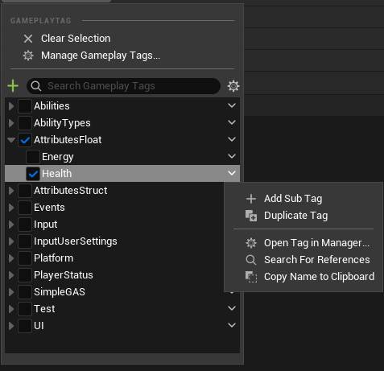

# Gameplay Tags

## What Are Gameplay Tags?

Gameplay tags are a flexible way to label and categorize things in your game. Think of them as keywords or hashtags that you can attach to game elements to give them meaning and make them searchable.

In SimpleGAS, gameplay tags are used extensively to:
- Control when abilities can activate
- Identify attributes
- Filter events
- Mark game states (like "Player.Stunned" or "Combat.InProgress")



## Why Use Tags Instead of Strings?

You might wonder why we don't just use regular strings. Gameplay tags offer several advantages:

1. **Optimized Queries**: The gameplay tag system is optimized for container operations and hierarchical queries that would be complex to implement with plain strings
2. **Hierarchy**: Tags can form parent-child relationships (like "Damage.Fire.DoT")
3. **Editor Support**: The tag picker UI prevents typos and helps discovery
4. **Organization**: The hierarchical structure helps keep your game systems organized

## How Tags Work in SimpleGAS

Here are some common ways gameplay tags are used in SimpleGAS:

### Ability Activation

Tags can control when abilities can be used:

```cpp
// An ability might have:
ActivationRequiredTags = [Player.Grounded, Combat.WeaponEquipped]
ActivationBlockingTags = [Player.Stunned, Player.Dead]
```

This means the ability can only activate when the player is grounded and has a weapon, and can't be used when stunned or dead.

### Attribute Identification

Tags uniquely identify attributes in your game:

```cpp
// A health attribute might use:
AttributeTag = [Attributes.Vital.Health]
```

### State Marking

Tags can represent temporary states:

```cpp
// When a player is stunned:
AbilityComponent->AddGameplayTag("Player.Status.Stunned");

// Later, you can check:
if (AbilityComponent->GameplayTags.HasTag("Player.Status.Stunned"))
{
    // Disable input, play stun animation, etc.
}
```

### Event Filtering

The SimpleEventSubsystem uses tags to filter events:

```cpp
// Listen for damage events:
EventSubsystem->ListenForEvent(
    this, false,
    FGameplayTagContainer(FGameplayTag::RequestGameplayTag("Events.Damage")),
    FGameplayTagContainer(),
    MyDamageDelegate
);
```

## Creating Your Own Tags

You can define gameplay tags in your project by:

1. Creating a new `GameplayTagsList.ini` file
2. Adding tags through the Project Settings → Gameplay Tags interface
3. Defining tags in C++ at startup

For example, in an .ini file:
```ini
[/Script/GameplayTags.GameplayTagsList]
GameplayTagList=(Tag="Player.Status.Stunned",DevComment="Player is stunned and cannot act")
GameplayTagList=(Tag="Ability.Type.Attack",DevComment="This ability is an attack action")
GameplayTagList=(Tag="Attributes.Vital.Health",DevComment="Health attribute")
```

## Tag Tips and Best Practices

- **Use hierarchies**: Structure tags with parent-child relationships (e.g., "Damage.Fire.DoT")
- **Be consistent**: Develop naming conventions and stick to them
- **Think ahead**: Design your tag structure to accommodate future expansion
- **Use containers**: The `FGameplayTagContainer` class lets you group related tags together
- **Explicit matching**: Consider when to use exact matching (`HasTagExact`) vs. hierarchical matching (`HasTag`)

## Want to Learn More?

Tom Looman has written [an excellent article](https://www.tomlooman.com/unreal-engine-gameplaytags-data-driven-design) that dives deeper into gameplay tags and their uses in Unreal Engine.