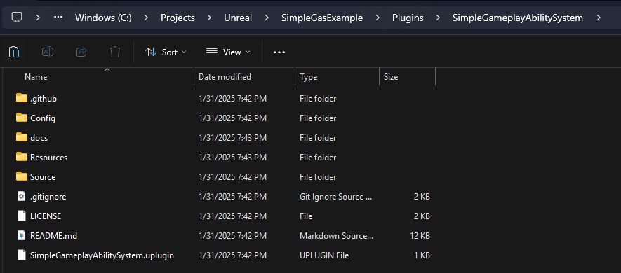

# Installing the plugin

{: .note }
This plugin requires Unreal Engine 5.2 and later to work.  
If you are starting with a Blueprint only project follow all the steps.  
If you already have C++ code in your project you can go straight to Step 3.

  
Step 1: Convert Your Blueprint Project into a C++ Project

Since Blueprint projects do not have a Visual Studio solution (`.sln`) or C++ support enabled by default, you need to add a C++ class to generate these files.  
We need to generate these files because the plugin is written in C++ and needs to be compiled to be usable in the editor.

1. Go to **File** > **New C++ Class**.
2. In the **Add C++ Class** window:
   - Choose **None (Empty Class)** or any other minimal option (e.g., **Actor**).
   - Click **Next**.
   - Name your class (e.g., `MyFirstCppClass`).
   - Click **Create Class**.
3. Wait for Unreal to compile the C++ code. This will generate the necessary Visual Studio files for your project.
4. Once finished, close the editor.

  
Step 2: Regenerate the Visual Studio Project Files

Since you've added some code, you need to update your project files.

1. Navigate to your project folder.
2. **Right-click on the `.uproject` file** and select **Generate Visual Studio project files** (you may need to click on **Show more options** on Windows to see the context menu option).
3. Open the newly generated `.sln` file in **Visual Studio** (or **Rider** if you use that).
4. In **Visual Studio**, set the build configuration to **Development Editor** and **build the project** (`Ctrl+Shift+B`).

  
Step 3: Add the plugin to your project

1. [Download or clone the SimpleGAS repository](https://github.com/strayTrain/SimpleGameplayAbilitySystem) into your Unreal Engine project under your project's Plugins folder. Create the Plugins folder if it doesn't exist. 
    - e.g. If your project folder is `C:\Projects\SimpleGASExample` then place `SimpleGameplayAbilitySystem` in `C:\Projects\SimpleGASExample\Plugins`
    - 
2. Rebuild your project and run the editor.
3. Enable the plugin in your Unreal Engine project by navigating to Edit > Plugins and searching for "SimpleGameplayAbilitySystem". (it should be enabled by default)

*Note from the dev: I haven't tested this on Mac or Linux as I don't have machines running those on hand. If anyone can supply steps/screenshots of the process as a PR on the project it would be much appreciated!*